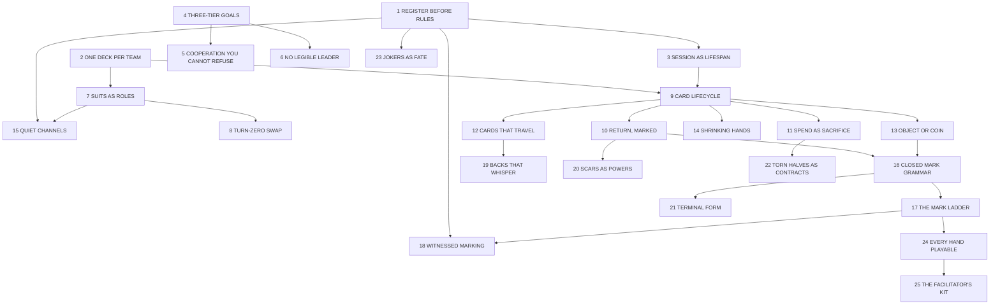

# A Pattern Language for the Consumable-Deck Engine

*Version 0.1 — a design atlas for building games on the multi-team, suit-partitioned, destructively-modified 52-card engine.*

---

## How to use this language

This document follows Christopher Alexander's form. Patterns are ordered from the largest decisions (the shape of a whole game) down to the smallest (what a single mark on a single card means). Each pattern:

- opens with a **context** linking it to the larger patterns it helps complete;
- states a **problem** as a tension between forces, in bold;
- discusses how the forces resolve differently under different **conditions** — the facilitator's situation, the register of play, and the story being told;
- closes with a **therefore** — an instruction, sometimes conditional;
- and ends with links to the smaller patterns that complete it.

To design a game with the engine, do as Alexander instructs: choose the patterns relevant to your project, arrange them in a sequence from largest to smallest, and work through them in order, letting each decision constrain the next. A suggested entry sequence is given below. You do not need every pattern; you do need the starred ones.

**This language is normative, in Alexander's sense.** Patterns do not merely map the option space; they recommend. Where the right resolution depends on conditions — register, setting, facilitator capacity — the therefore is conditional, but it still tells you what to do under each condition. A designer departing from a pattern should do so knowingly, able to say which force they are resolving differently and why.

**Confidence marks.** ★★ means the pattern is strongly evidenced in comparable published games and you should treat departing from it as a deliberate act. ★ means the reasoning is sound but the pattern is untested in this engine. No star means the pattern is a live hypothesis: prototype it before a design leans on it. Each pattern's supporting games and writing are listed in the Evidence Register (Appendix C), keyed to the project's annotated bibliography. How marks are upgraded, and how the language itself changes, is governed by Appendix B.

---

## The network

**Prerequisites (hard):** 2 before 7; 7 before 8; 9 before 10/11/12/13/14; 16 before 17/21; 17 before 18 and 24.
**Strong sympathies:** 11 + 22; 12 + 19; 10 + 20; 1(larp) + 18 + 23; 14 + 20.
**Known tensions:** 12 vs 13 (travelling cards push toward objecthood; high-volume markets push toward currency); 19 vs any face-down randomness; 11 vs 14 (heavy spending plus no replenishment shortens the game sharply); 6 vs 8 (a swap that advantages a leader role makes the leader legible); 15 vs the larp register (role-play wants open talk).

## A suggested generative sequence

1 REGISTER BEFORE RULES → 3 SESSION AS LIFESPAN → 4 THREE-TIER GOALS → 2 ONE DECK PER TEAM → 7 SUITS AS ROLES → 9 CARD LIFECYCLE (choose your mix of 10/11/12) → 13 OBJECT OR COIN → 16 CLOSED MARK GRAMMAR → 17 THE MARK LADDER → then the remaining patterns as your setting calls for them, finishing always with 24 EVERY HAND PLAYABLE and 25 THE FACILITATOR'S KIT.

---

# SCALE I — THE SHAPE OF A WHOLE GAME

## 1. REGISTER BEFORE RULES ★

*This pattern precedes everything; it sets the adjudication bandwidth available to all the patterns below.*

**The same engine must serve a boxed tabletop game, a facilitated megagame, and a chamber larp — but each register has radically different capacity for ambiguity, and rules written for one register fail in another.**

A boxed tabletop game has no human adjudicator: every mark, swap, and goal must be self-enforcing and unambiguous, because the rulebook is the only authority at the table. A megagame has a control team: ambiguity is acceptable where control can rule on it, and is even desirable as negotiation space. A larp has facilitators *and* a fiction-first social contract: marks can be diegetic acts whose meaning is partly interpretive, and tone matters more than balance.

The story register matters too. A salvage-crew setting tolerates sharp, adversarial readings of rules; a pandemic-hospitals setting wants soft tension where defection is deniable and adjudication gentle.

Therefore: **decide the register first, and write every subsequent pattern's resolution to the adjudication bandwidth that register provides.** If you intend the engine to serve multiple registers, write the boxed-tabletop (zero-bandwidth) resolution as the base case and treat facilitated registers as relaxations of it — never the reverse.

*Completed by: QUIET CHANNELS (15), WITNESSED MARKING (18), JOKERS AS FATE (23).*

## 2. ONE DECK PER TEAM ★★

*The engine's invariant foundation.*

**A game economy needs components that are asymmetric, legible, and emotionally safe to destroy — but bespoke components are expensive, and destroying expensive things makes players flinch.**

The standard 52-card deck is the only component that is universally available, costs almost nothing, carries rich internal structure (4 suits × 13 ranks, 12 face cards, 2 jokers), and is already understood by every player at the table. Giving each team exactly one deck makes the team's total capacity visible and finite, makes scaling to more teams arithmetic rather than redesign, and — critically — makes destruction guilt-free. This is the engine's identity: legacy at session speed, on components you replace at any corner shop.

Therefore: **each team receives one standard deck at setup, and the deck is the team's entire economy. Resist adding bespoke card components; spend the deck's unused structure (rank bands, face cards, aces, jokers, colours) before inventing anything.**

*Completed by: SUITS AS ROLES (7), CARD LIFECYCLE (9), JOKERS AS FATE (23).*

## 3. SESSION AS LIFESPAN ★★

*Within ONE DECK PER TEAM (2), under the register chosen in (1).*

**Legacy mechanics create the most engaging permanence in modern design, but campaign legacy demands schedule commitment, repeated groups, and expensive boxes — luxuries facilitators of one-shots, conventions, and larps do not have.**

EXIT-style games prove single-session destruction is viable; Ten Candles proves it can be the emotional core. Compressing the legacy arc into one sitting means the deck must travel from pristine to ruined inside the session, and the *pacing of ruin* becomes a designed curve: roughly untouched in the opening, visibly scarred by the midpoint, and ending with hands whose every card tells the session's history. The endgame should be designed *for* ruined decks, not despite them.

If your conditions differ — a club that meets weekly, a campaign appetite — the variant is one rule away: teams keep their ruined decks between sessions. But this is a variant; the engine's base identity is the consumable one-shot, and rules text should give explicit *permission* to destroy, because players need it.

Therefore: **design each game as a complete arc of one deck's ruin within one session, with the rulebook explicitly licensing destruction. Offer campaign continuity as a clearly-marked variant, never the default.**

*Completed by: CARD LIFECYCLE (9), SHRINKING HANDS (14), TERMINAL FORM (21).*

## 4. THREE-TIER GOALS ★

*The motivational architecture of any game built on this engine.*

**Pure cooperation produces quarterbacking and flat drama; pure competition discards the engine's team structure; but mixed goals, naively layered, collapse into incoherence where players cannot tell what they are supposed to want.**

The engine stipulates goals at three tiers — individual, intra-team, inter-team — deliberately in tension. The design question is the *proportion and visibility* of each tier, and the right answer is conditioned by story. A salvage-crews setting can weight individual and team goals heavily and make them openly adversarial: piracy is the genre. A pandemic-hospitals setting should weight the shared tier heavily and keep individual goals small, secret, and *deniable* — institutional pride, budget protection — so that tension expresses as friction, not betrayal. Convention play favours fewer, louder goals (players have one session to parse them); home and campaign play tolerates subtle goal stacks.

Decide also how tiers convert to a result: weighted points (legible, gamey), gated thresholds (the shared goal must be met before any lower tier counts — strongly stabilising), or narrative adjudication (larp register only).

Therefore: **give every player exactly one goal at each tier; let the setting dictate the weighting; and in any setting where cooperation is the story, gate lower tiers behind the shared outcome.**

*Completed by: COOPERATION YOU CANNOT REFUSE (5), NO LEGIBLE LEADER (6).*

## 5. COOPERATION YOU CANNOT REFUSE ★★

*Within THREE-TIER GOALS (4); the semi-coop stabiliser.*

**If selfish play is viable, the cooperative layer becomes theatre; if cooperation is total, individual goals become flavour text. Semi-cooperative games die on this edge constantly.**

The published record (Dead of Winter, Archipelago, and their critical reception) shows the stable resolutions: make cooperation *instrumentally necessary* — no team, and no player, can reach even their selfish goals without transacting with others. In this engine the lever is mechanical and elegant: design game systems whose card appetites exceed any single suit or any single team's remaining deck. A contract that demands a flush across three suits forces intra-team cooperation; a crisis that demands forty cards in a turn forces inter-team cooperation. Defection then becomes a question of *degree and timing*, not a separate strategy.

Make defection visible in hindsight rather than invisible: marked cards (CLOSED MARK GRAMMAR, 16) leave an audit trail of who contributed what, which is exactly the deniable-but-discoverable texture good semi-coop needs.

Therefore: **tune system card-appetites so that no goal at any tier is reachable from one hand, one suit, or — for shared crises — one team. Let the marks keep the receipts.**

*Completed by: CARDS THAT TRAVEL (12), CLOSED MARK GRAMMAR (16).*

## 6. NO LEGIBLE LEADER ★

*Within THREE-TIER GOALS (4), for the inter-team layer.*

**Multi-team competitive play invites bash-the-leader and kingmaking: when standing is legible, trailing teams gang up or hand victory away, and the midgame becomes about the scoreboard instead of the story.**

The megagame tradition's answer is plurality and partial opacity: many goals, partially hidden, so no single ranking exists to coordinate against. This engine adds a second device for free — ruined decks are misleading scoreboards. A team with a shredded deck may be winning (they spent hard on their gated shared goal) or dying; outsiders cannot tell. Preserve that ambiguity: avoid public victory-point tracks in any setting with serious inter-team competition. In softer settings (the hospitals), a public shared-progress track is fine and even desirable — the *shared* tier can be legible so long as the competitive tiers are not.

Therefore: **keep competitive standing illegible — hidden goals, no public competitive score track — while allowing shared-tier progress to be as public as the story wants.**

*Tension with: TURN-ZERO SWAP (8) — a swap that visibly advantages a leader role makes leaders legible; if 6 matters in your game, make role-swaps symmetric in appearance.*

---

# SCALE II — THE TEAM AND ITS ECONOMY

## 7. SUITS AS ROLES ★★

*Within ONE DECK PER TEAM (2).*

**A team of four needs asymmetric capabilities that are instantly legible and cost nothing to teach — but asymmetry usually means bespoke player boards and a long rules explanation.**

Dividing the deck by suit gives each player a visually distinct hand, an identity ("you're hearts"), and a structural limitation that creates interdependence before any rule is written. The suit-to-role mapping *is* the setting layer: hearts as medical, spades as security, diamonds as finance, clubs as engineering in one game; something else entirely in another. The mapping should be thematic enough that players can guess a card's domain from its suit without a reference sheet.

Conditions vary the partition. Teams of two take two suits each; teams of five or six split a suit or add a second deck; a setting can deliberately mis-deal (one player starts with a mixed hand) when the story wants a generalist or an outsider.

Therefore: **partition each team's deck by suit at setup, name the suits in the setting's vocabulary, and let every later system speak in suit-language ("this crisis eats hearts").**

*Completed by: TURN-ZERO SWAP (8), QUIET CHANNELS (15).*

## 8. TURN-ZERO SWAP ★

*Within SUITS AS ROLES (7), during setup.*

**Players arrive cold: they don't know the trade verb, haven't spoken to each other, and hold hands that express suit but not yet role.**

A structured exchange before turn one does three jobs at once: it differentiates hands by role (the leader collects face cards, the specialist collects a rank band), it rehearses trading before stakes exist, and it forces every pair of teammates to transact once. Each role's swap rule should be *beneficial in the direction of that role's mechanics* so the swap teaches what the role wants.

Conditions: in convention or larp play with strangers, the swap's social function is the most valuable thing it does — keep it. With an established group on a repeat setting, it can be compressed to a fixed deal. If NO LEGIBLE LEADER (6) matters in your game, keep swap rules symmetric in appearance so observers cannot read role hierarchies from the exchange.

Therefore: **give every role a one-line swap rule executed before turn one, designed so the resulting hand visibly resembles the role.**

## 9. CARD LIFECYCLE ★★ (decision hub)

*Within ONE DECK PER TEAM (2) and SESSION AS LIFESPAN (3). The single most load-bearing decision in any game built on the engine.*

**Fifty-two cards per team is a small economy. What happens to a card after it is played determines the entire shape of the game — and the engine permits three different answers that produce three different games.**

The three resolutions are patterns 10, 11, and 12: cards **return marked**, cards are **spent forever**, and cards **travel to other hands**. Almost every good game on this engine will mix them, assigning each verb to a different class of action. The mix is conditioned by session length and story: a short convention slot wants heavy spending (fast arc of ruin); a long negotiation-rich megagame wants heavy travel; a character-driven larp wants heavy marking (objects accrue biography).

Budget arithmetic first: estimate card-plays per player per turn × turns. If plays exceed ~13 per player and your mix is spend-heavy, you must add replenishment or accept SHRINKING HANDS (14) as the designed arc.

Therefore: **before designing any game system, write the lifecycle sentence: "In this game, [action class] returns the card marked, [action class] spends it forever, [action class] sends it elsewhere." Every system rule must then say which verb it uses.**

*Completed by: 10, 11, 12, 13, 14.*

## 10. RETURN, MARKED ★

*A resolution of CARD LIFECYCLE (9); the engine's default verb.*

**If most plays destroy or discard, hands collapse before competence develops; but if plays change nothing, the engine's identity — deepening through accumulation — never appears.**

Returning the card to hand *with a mark* keeps the economy stable while mutating it: the same thirteen cards, progressively scarred, each scar a rules consequence and a memory. This is the verb that makes decision depth grow in step with player skill, and the verb that produces the end-of-session table covered in artefacts. It is also the cheapest verb to balance, because the card count never changes — only the texture.

Therefore: **make return-marked the default outcome of using a card in a game system; reserve the other verbs for emphasis.**

*Completed by: CLOSED MARK GRAMMAR (16), SCARS AS POWERS (20). Sympathy: a story about endurance, institutions, or memory should be built almost entirely on this verb.*

## 11. SPEND AS SACRIFICE ★

*A resolution of CARD LIFECYCLE (9); the dramatic verb.*

**Permanent loss is the strongest beat physical games can deliver, but if it is routine it is bookkeeping, and if it is too costly players never volunteer for it.**

Spending a card forever — torn, surrendered, burned in the larp register — should be rare, voluntary, and witnessed. Attach it to the actions the story considers irreversible: scuttling a ship section, breaking quarantine, betraying a treaty, a character's defining cost. Because the deck is cheap (ONE DECK PER TEAM, 2), players will actually do it — this is the engine's licence to use a verb most games can't afford.

Conditions: convention one-shots can raise the spend rate (the arc must finish in two hours). Settings with children or players uneasy about destruction route this verb through the no-tear substitutes in EVERY HAND PLAYABLE (24).

Therefore: **attach permanent card loss only to story-irreversible actions, make it the player's choice, and stage it so the table sees it happen.**

*Completed by: TORN HALVES AS CONTRACTS (22). Tension: heavy use of 11 with no replenishment forces SHRINKING HANDS (14) — verify the arithmetic.*

## 12. CARDS THAT TRAVEL (no star — prototype first)

*A resolution of CARD LIFECYCLE (9); the negotiation verb.*

**Inter-team play needs a medium of exchange, but introducing a separate currency abandons the engine's single-component identity.**

Let cards themselves move — payments, trades, ransoms, salvage. A travelling card carries its suit (capability now in foreign hands), its marks (history and intel — Team B can read what Team A's medic did with this card), and its back. This is the engine's most novel emergent layer: provenance. Decks sold in different back colours give free team-of-origin tracking; a hand full of foreign-backed cards *is* a diplomatic record.

The risks are real and untested: travel at volume erodes suit-as-role identity, pushes cards toward currency (tension with OBJECT OR COIN, 13), and interacts dangerously with hidden hands (BACKS THAT WHISPER, 19). Megagame and trade-heavy settings should embrace it; tight tactical settings should restrict it to a few high-ceremony transfers per session.

Therefore: **if your setting is negotiation-rich, let cards change team ownership and use per-team back colours for provenance — but cap the volume until playtesting shows where role identity starts to dissolve.**

## 13. OBJECT OR COIN ★

*Within CARD LIFECYCLE (9); the fungibility boundary.*

**Paying costs treats cards as interchangeable currency; marking treats them as unique objects with biographies. A design that lets the same card be both at once confuses players about what they are holding.**

The resolution is a *boundary*, not a choice of one side: unmarked cards are coins, marked cards are objects. The moment a card takes its first mark it leaves the currency pool and becomes a named thing — it can still be played, but systems now read its history, and players will (correctly) start calling it "the triage seven" rather than "a seven." This gives the game a designed drift from economy to biography that mirrors the session's arc: early turns are transactional, late turns are personal.

Story conditions set the drift rate. An institutional drama wants most of the deck to become objects (slow economy, heavy meaning); a fast piratical game keeps most cards coins and lets only a handful become legends.

Therefore: **rule that an unmarked card is fungible and a marked card is unique; let every system state whether it accepts coins, objects, or both; and pace the marking rate to control the drift the story wants.**

## 14. SHRINKING HANDS (no star — prototype first)

*Within CARD LIFECYCLE (9), when spending outpaces replenishment.*

**A shrinking hand can be the story — escalating scarcity, exhaustion, triage — or it can be elimination-by-instalments that benches a player while the game continues.**

If the design embraces shrinkage, design the floor: a player at three cards should face the most interesting decisions of their session, not the fewest. Devices: SCARS AS POWERS (20) so degraded cards gain late-game value; systems whose costs scale down as crises peak; roles whose power derives from *others'* cards (the coordinator spends nothing). If the design rejects shrinkage, add replenishment — but the only on-theme source is other hands and other teams (CARDS THAT TRAVEL, 12); resist introducing a fresh draw pile, which dilutes the one-deck identity and breaks the finite-capacity legibility of ONE DECK PER TEAM (2).

Therefore: **either design scarcity as the explicit arc with a protected floor of agency, or replenish exclusively through circulation — never through new cards.**

## 15. QUIET CHANNELS ★

*Within SUITS AS ROLES (7) and REGISTER BEFORE RULES (1); against quarterbacking.*

**Team coordination is the point of the engine, but open coordination invites one voice to play four hands.**

Suit partition already helps structurally — the leader cannot hold or fully see the team's capabilities. The remaining lever is communication constraint, and it must be tuned to register. Boxed tabletop: hard constraints work (The Crew, Hanabi — you may state what you can do, not what others should do; or planning talk only between turns). Megagame: physical separation does it for free — put the game systems in different parts of the room so a leader literally cannot supervise everyone (Captain Sonar's lesson, scaled up). Larp: do not constrain talk mechanically; the fiction constrains it — a character giving orders is *playing a character giving orders*, which is content, not a problem.

Therefore: **choose the register's natural constraint — rules-limited speech for boxed play, spatial separation for facilitated play, fiction for larp — and make at least some intra-team information structurally private in all three.**

---

# SCALE III — CARDS AND MARKS

## 16. CLOSED MARK GRAMMAR ★★

*Within RETURN, MARKED (10) and OBJECT OR COIN (13). The keystone of the small scale.*

**Every mark on a card is a rules exception attached to an object. Freeform marking is maximally expressive and maximally illegible: ten turns in, nobody can parse a hand at a glance, and the table spends its time reading state instead of making decisions.**

Design an alphabet, not a graffiti permit. A small closed set of mark types — three is a good ceiling for a one-shot — each with one consistent meaning *across all game systems*. A workable default grammar: **punch = permanent capability change** (this card's function is altered), **sticker = removable status** (a condition that can be cured or expire), **ink = information** (words that tell, never words that do). Systems may define what a punch means in their context, but never what a punch *is*.

Conditions: the boxed register needs the grammar printed on a reference card and absolutely closed. Facilitated registers can hold a fourth, facilitator-only mark in reserve. Settings re-skin the alphabet's fiction (the punch is shrapnel, the sticker is a quarantine seal) without touching its mechanics.

Therefore: **fix a closed alphabet of at most three player-applied mark types, give each a single invariant mechanical meaning, and let settings vary only the fiction and the systems' interpretation — never the alphabet itself.**

*Completed by: THE MARK LADDER (17), TERMINAL FORM (21). Prerequisite for everything below.*

## 17. THE MARK LADDER ★

*Within CLOSED MARK GRAMMAR (16).*

**Each marking technology trades expressiveness against adjudicability: stickers are standardised and reversible, ink is permanent and freeform, tearing and punching are irreversible and binary. Assigning the wrong rung to a job creates disputes or kills drama.**

Match permanence of mark to permanence of meaning. Reversible game states get stickers; irreversible history gets ink or punches; story-irreversible sacrifice gets the tear (SPEND AS SACRIFICE, 11). The freeform rung — written words — is where disputes live; in the boxed register, restrict ink to choosing from a printed word list; in facilitated registers, free writing is part of the fun and control adjudicates.

There is also a sensory ladder: a punch can be *felt* in a held hand without looking; a sticker is read at a glance across a table; ink must be brought close. Use the punch for information a player needs constantly, the sticker for information opponents need to see, ink for information that should require inspection — which makes inspection itself a game action.

Therefore: **assign each rung — sticker, ink, punch, tear — to meanings of matching permanence and matching read-distance, and in the boxed register replace free writing with a closed word list.**

## 18. WITNESSED MARKING ★

*Within THE MARK LADDER (17) and REGISTER BEFORE RULES (1).*

**Players applying marks to their own cards in a competitive game is an honour-system pressure point; but checkpointing every mark through an authority makes the engine's most frequent verb slow.**

Calibrate ceremony to stakes and register. Boxed tabletop: the rule is "announce, then mark" — the mark is applied openly on the table, and an unannounced mark is void. Megagame: routine marks are announce-then-mark; contested or high-value marks are applied by control, which also gives control a visible runtime presence. Larp: marking *is* ritual — the medic stamps the triage punch in front of the patient because the act is content; cheating is handled as a social-contract breach, not a rules problem.

Therefore: **make every mark a public act — announced and applied in view — and reserve authority-applied marks for whatever your register considers high stakes.**

## 19. BACKS THAT WHISPER (no star — prototype deliberately)

*Within CARDS THAT TRAVEL (12); a consequence that must be ruled on early.*

**The moment any mark touches a card's back, that card is identifiable face-down — and every mechanic relying on shuffled anonymity is quietly broken for it.**

Two coherent resolutions exist; drifting between them ruins both. **Resolution A — faces only:** backs are sacrosanct, all marks go on faces, face-down randomness remains available to systems. Choose this for any design using draw piles, hidden deployment, or face-down bluffing. **Resolution B — the whisper is the game:** backs may carry ink, and identifiability is embraced — a marked card in a face-down pool is trackable by anyone who saw it marked, creating a memory-and-intel layer; information written on a back deliberately leaks across the hidden/visible boundary into opponents' hands when cards travel. Choose this for espionage, contagion, and rumour stories, and accept that shuffled randomness is gone for marked cards.

Therefore: **rule globally, at design time, whether backs can be marked. If yes, delete face-down randomness from your systems and design the tracking game on purpose; if no, print it as a hard rule.**

## 20. SCARS AS POWERS ★

*Within RETURN, MARKED (10) and SHRINKING HANDS (14); against the death spiral.*

**Destructive modification compounds: damaged cards perform worse, producing worse outcomes, producing more damage. Trailing players slide into an unwinnable, unfun endgame.**

Break the spiral by making some systems *prefer* scarred cards. The fiction writes itself in any setting: the wreck-dive pays double for cards that have clearly done this the hard way before; the veteran ward trusts the punched triage card; the black market only buys cards with history. Late-game systems especially should have appetites for ruin, so the session's arc rewards the very decay it inflicts. This converts the deck's degradation from a loss curve into a *transformation* curve — early-game value and late-game value live in different cards.

Therefore: **for every mark that worsens a card in some systems, ensure at least one system — preferably a late-game one — where that mark improves it.**

## 21. TERMINAL FORM (no star)

*Within CLOSED MARK GRAMMAR (16); against exception saturation.*

**Marks accumulate without limit, and past a saturation point a card is a paragraph of errata nobody reads.**

Cap the biography. A clean device: a card may carry at most three marks; the third mark is its *terminal form* — the card's final identity, after which it can be transformed no further, only played or spent. Terminal forms can be where a setting puts its legends: a triple-marked card might gain a title, a one-line power, a place in the debrief. The cap also paces the session (TERMINAL FORM cards clustering is a signal the endgame has arrived) and bounds the parsing load on every hand.

Therefore: **cap marks per card — three is the working default — and make reaching the cap mean something.**

## 22. TORN HALVES AS CONTRACTS (no star — a gift sitting on the table)

*Within SPEND AS SACRIFICE (11), for negotiation-rich settings.*

**Inter-team agreements in physical games are usually unenforceable talk; the engine destroys cards anyway and leaves halves as waste.**

Tear a card to seal a deal: each party holds half. The halves are unfakeable (they physically match), legible (suit and rank survive the tear), and dramatic (the tear is performed at the handshake). Reuniting the halves executes the contract — payment due, alliance invoked, ransom collected. A broken promise leaves the wronged party holding half a card as evidence, which facilitated registers can price and boxed registers can score. The spent card's value sets the contract's stake: tearing a king promises more than tearing a three.

Therefore: **in any setting with negotiation, let treaties be sealed by tearing a card between the parties, with reunification as execution and the rank as the stake.**

## 23. JOKERS AS FATE (no star)

*Within ONE DECK PER TEAM (2) and REGISTER BEFORE RULES (1).*

**Facilitated games need a sanctioned interrupt — a way for control or fate to intervene — and the deck ships with two cards the suit partition doesn't use.**

The jokers are free design space with built-in mystique. Options by register: boxed — jokers are one-shot wildcards dealt to no one, earned through play; megagame — control holds the jokers and plays them as crisis injects or rewards; larp — the joker is a tangible fate-token a facilitator hands a player, licensing one impossible act. Two jokers per team scales the intervention budget with team count automatically.

Therefore: **reserve the jokers for whatever your register's highest authority is — luck, control, or fate — and never fold them into the ordinary economy.**

## 24. EVERY HAND PLAYABLE ★★

*Within THE MARK LADDER (17). Non-optional.*

**Tearing and punching demand dexterity and tools; red/black is only two colours; small ink marks are illegible to low-vision players. An engine whose core verbs exclude players is broken at the foundation, and an accessibility patch bolted on later never reaches parity.**

Design the substitutions into the grammar itself: every destructive verb has a first-class sticker equivalent (a "torn" sticker is mechanically identical to a tear); stickers vary by *shape* as well as colour; the punch is inherently accessible (tactile) and should carry the most-needed information; written marks use thick markers and a large-print word list. The no-tear variant doubles as the variant for players uneasy with destruction and for venues where destruction is impractical — one variant, three audiences.

Therefore: **specify the sticker-equivalent for every destructive verb and the shape-coding for every colour-coding in the core rules, not an appendix.**

*Completed by: THE FACILITATOR'S KIT (25).*

## 25. THE FACILITATOR'S KIT ★

*Completing EVERY HAND PLAYABLE (24) and the whole language.*

**The engine's components are everywhere, but its tools are not: a session without punches, stickers, and markers in sufficient supply degrades to talk.**

A game on this engine ships (or the facilitator assembles) a kit: one deck per team plus spares, single-hole punches (one per team), sticker sheets in the grammar's shapes and colours, chunky markers, the printed mark-grammar reference cards, the word list if the boxed register demands one, and — if punch *position* carries meaning — a stencil so a punch in the "engine slot" is distinguishable from one in the "crew slot." The stencil is the cheap road to a richer punch vocabulary without reopening the closed grammar.

Therefore: **specify the kit as part of the design, one line per tool, with quantities per team — and treat a missing tool as a missing rule.**

---

## Appendix A — From the design questions to the patterns

| Question (analysis doc §7) | Pattern(s) |
|---|---|
| 1–3 economy lifecycle, replenishment, play-count arithmetic | 9, 10, 11, 12, 14 |
| 4 fungible vs unique | 13 |
| 5–6 hidden info, back-marks, face-down randomness | 15, 19 |
| 7–9 mark types, authority, caps, torn halves | 16, 17, 18, 21, 22 |
| 10 accessibility variant | 24, 25 |
| 11–12 goal scoring and tier outcomes | 4, 5 |
| 13 quarterbacking | 15 |
| 14 inter-team touchpoints | 5, 12, 22 |
| 15–16 turn structure, pacing of ruin | 1, 3, 21 |
| 17 engine vs SRD | the language itself; settings select and re-skin patterns |
| 18 tabletop vs larp register | 1, 15, 18, 23 |
| 19 campaign mode | 3 (variant) |
| 20 facilitator kit | 25 |

## Appendix B — How this language evolves

**Heritage, honestly stated.** Alexander built *A Pattern Language* by observing buildings and towns that already existed and worked; his confidence stars were claims about evidence gathered from the built world. This language inverts that method out of necessity: the engine has no built examples yet, so most patterns here begin life as hypotheses, supported where possible by *adjacent* built things — published games and design research that exercise one force or another of a pattern without exercising the whole. We keep Alexander's form and his normative stance while being candid that our evidence starts thinner than his. The debt is acknowledged; the burden of proof is ours.

**The update protocol.**

1. **Worked examples are the mines.** Every game built on the engine (e.g. a salvage-crews tabletop, a pandemic-hospitals larp) is a site for mining the language: each playtest report should state which patterns were used, which resolutions were chosen, and what happened.
2. **Stars are earned, not asserted.** A pattern gains ★ when one worked example uses it and the playtest supports its therefore; it gains ★★ when it survives two worked examples in *different registers*. A pattern contradicted by play is downgraded, rewritten, or retired — and retirement is recorded, not deleted, so the language remembers its dead ends.
3. **Evidence is single-sourced.** Every claim of support points to an entry in the project's annotated bibliography via the Evidence Register (Appendix C). New references enter the bibliography first, then the register. As patterns migrate to individual wiki pages, evidence lines may move inline, but the bibliography remains the single source of truth.
4. **Names are cheap until they aren't.** Pattern names in v0.x may be changed freely; from v1.0, renames require a deprecation note, because the names will be community vocabulary by then.
5. **Splitting and merging.** If a worked example shows a pattern resolving its forces two genuinely different ways under different conditions — beyond what a conditional therefore can carry — split it. If two patterns are always applied together and never apart, merge them.
6. **New patterns** must arrive in the full form: context, problem-as-forces, conditional discussion, therefore, links, and at least one evidence entry (a published game, research, or a documented playtest). A mechanic without a stated problem is not a pattern.
7. **Versioning.** The language carries a version number and a change log. Worked examples cite the version they were built against, so a game and the language that shaped it remain mutually interpretable.

## Appendix C — Evidence Register

Citation keys refer to the project's annotated bibliography. *Hyp.* marks the portion of a pattern that currently rests on hypothesis rather than precedent.

| # | Pattern | Evidence |
|---|---|---|
| 1 | REGISTER BEFORE RULES | Megagame control practice [wallman]; larp facilitation [koljonen2019]. *Hyp.:* base-case ordering (boxed first). |
| 2 | ONE DECK PER TEAM | Structural exploitation of the deck [quietyear], [regicide]; legacy cost objections [daviau-gdc]. |
| 3 | SESSION AS LIFESPAN | Single-session destruction [exit], [tencandles]; pacing of permanent change [leacock-diaries], [daviau-gdc]. |
| 4 | THREE-TIER GOALS | Goal-tension designs [deadofwinter], [archipelago], [kingsdilemma]; multiplayer politics [elias2012]. |
| 5 | COOPERATION YOU CANNOT REFUSE | Collaborative design lessons [zagal2006]; instrumental trade [siderealconfluence]; semi-coop reception of [deadofwinter], [archipelago]. |
| 6 | NO LEGIBLE LEADER | Kingmaking & bash-the-leader analysis [elias2012]; megagame goal plurality [wallman]. *Hyp.:* ruined-deck illegibility. |
| 7 | SUITS AS ROLES | Suit-as-capability [regicide], [castlefalkenstein], [quietyear]; suit-bound team allocation [thecrew]. |
| 8 | TURN-ZERO SWAP | Drafting as hand-shaping (general practice, see [engelstein2019]). *Hyp.:* the triple function. |
| 9 | CARD LIFECYCLE | Economy formalism [dormans2012]; hand-management mechanism analysis [engelstein2019]. |
| 10 | RETURN, MARKED | Sticker-upgrade economies [gloomhaven]; persistence principle [daviau-gdc]. |
| 11 | SPEND AS SACRIFICE | Destruction as ritual [tencandles]; licensed destruction [exit]. |
| 12 | CARDS THAT TRAVEL | Open trading among asymmetric factions [siderealconfluence]. *Hyp.:* provenance layer, role-identity erosion threshold. |
| 13 | OBJECT OR COIN | Resource vs. unique-component distinction [engelstein2019]. *Hyp.:* mark-as-boundary rule. |
| 14 | SHRINKING HANDS | Death-spiral and comeback analysis [elias2012], [engelstein2019]. *Hyp.:* circulation-only replenishment. |
| 15 | QUIET CHANNELS | Constrained communication [thecrew], [hanabi]; spatial role separation [captainsonar]; dominant-player problem [zagal2006]. |
| 16 | CLOSED MARK GRAMMAR | Constrained modification sets [gloomhaven], [mysticvale]. *Hyp.:* three-type alphabet. |
| 17 | THE MARK LADDER | Component-destruction variety [exit]. *Hyp.:* permanence- and read-distance-matching. |
| 18 | WITNESSED MARKING | Ritualised acts in larp [tencandles], [koljonen2019]. *Hyp.:* announce-then-mark in boxed register. |
| 19 | BACKS THAT WHISPER | *Hyp. throughout*; informed by marked-deck practice in card handling. Prototype before reliance. |
| 20 | SCARS AS POWERS | Comeback-mechanism analysis [engelstein2019]. *Hyp.:* late-game appetite for ruin. |
| 21 | TERMINAL FORM | Capped modification slots [mysticvale]. *Hyp.:* three-mark cap, terminal titles. |
| 22 | TORN HALVES AS CONTRACTS | Real-world precedent: split tally sticks and indenture documents [tally-indenture]. *Hyp.:* in-game execution rules. |
| 23 | JOKERS AS FATE | Fate-deck authority [malifaux]; control injects [wallman]. |
| 24 | EVERY HAND PLAYABLE | Board game accessibility research [heron-mlu]; shape-plus-colour coding (standard accessible design practice). |
| 25 | THE FACILITATOR'S KIT | Megagame and larp kit practice [wallman], [koljonen2019]. |

## Appendix D — Status

This language is v0.1 and mostly unbuilt. The intended first act of evidence-gathering is the minimum prototype from the design analysis: one team, three systems with different card appetites, the three-mark grammar, six turns — then the first full worked example in each register.
